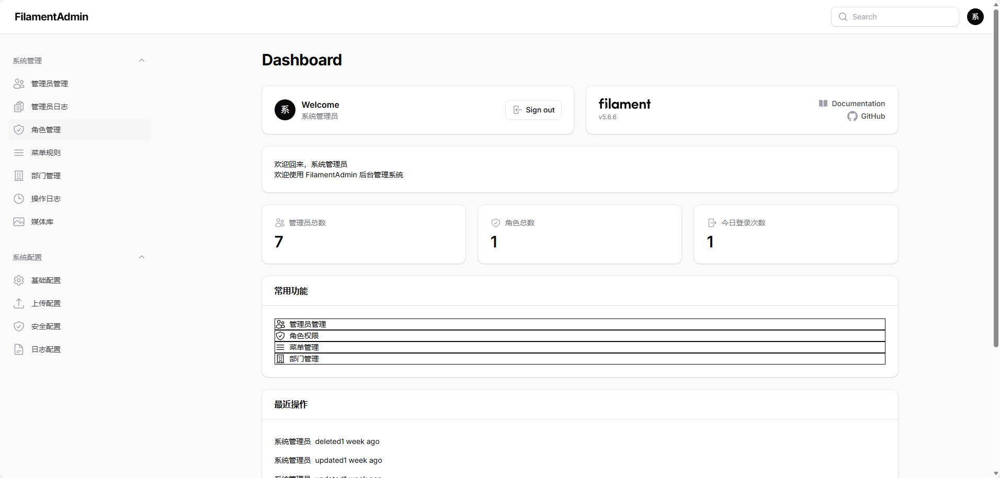

# FilamentAdmin

基于 Laravel 13 + Filament 5 的企业级后台基础包。`composer require` 一行命令，即可获得完整的认证、RBAC 权限、菜单管理、部门数据权限、操作日志等后台底座，在上面直接构建业务模块，无需重建基础设施。



<!-- 若 Packagist 未发布显示 404，Packagist 发布在 Phase 4 RELEASE-01 完成 -->
[](https://packagist.org/packages/laravelstack/filament-admin)
[](https://packagist.org/packages/laravelstack/filament-admin)
[](https://packagist.org/packages/laravelstack/filament-admin)
[](https://packagist.org/packages/laravelstack/filament-admin)
[](https://github.com/john-captain/filament-admin/actions/workflows/ci.yml)
<!-- TODO: RELEASE-05 本期跳过，Codecov 代码覆盖率徽章待将来注册 Codecov 账号后接入，届时替换此注释为真实徽章 -->

---

## 快速开始

### 第一步：安装

```bash
composer require laravelstack/filament-admin
```

### 第二步：发布资源

```bash
# 发布配置文件
php artisan vendor:publish --tag=filament-admin-config

# 发布数据库迁移
php artisan vendor:publish --tag=filament-admin-migrations

# 发布视图文件（如需自定义界面）
php artisan vendor:publish --tag=filament-admin-views

# 发布多语言文件（如需自定义翻译）
php artisan vendor:publish --tag=filament-admin-lang

# 发布 Stub 文件（如需自定义生成模板）
php artisan vendor:publish --tag=filament-admin-stubs
```

### 第三步：执行迁移与初始化

```bash
# 执行数据库迁移
php artisan migrate

# 创建超级管理员账号
php artisan db:seed --class="FilamentAdmin\\Database\\Seeders\\SuperAdminSeeder"
```

> **安全提示：** 默认账号为 `admin@example.com`，密码为 `password`，仅供初始化使用。
> **首次登录后请立即修改默认密码，请勿将默认账号用于生产环境。**

### 第四步：注册插件

在 `app/Providers/Filament/AdminPanelProvider.php` 中注册 FilamentAdmin 插件：

```php
use FilamentAdmin\FilamentAdminPlugin;
use Filament\Panel;
use Filament\PanelProvider;

class AdminPanelProvider extends PanelProvider
{
    public function panel(Panel $panel): Panel
    {
        return $panel
            ->id('admin')
            ->path('admin')
            ->login()
            ->authGuard('admin')
            ->plugins([
                FilamentAdminPlugin::make(),
            ]);
    }
}
```

更多详细安装配置，请参阅 [安装文档](https://github.com/john-captain/filament-admin/blob/main/wiki/installation.md)。

### 第五步：访问后台

启动开发服务器后，访问 `/admin`，使用以下账号登录：

- **邮箱：** `admin@example.com`
- **密码：** `password`

> **再次提示：** 首次登录后请立即前往个人资料页修改默认密码。

---

## 功能清单

### 认证与安全

- 自定义登录页（支持账号名 / 邮箱双模式登录）
- 防枚举攻击与登录限流
- 双因素认证（TOTP / 2FA）
- 登录日志自动记录

### 管理员管理

- 管理员用户 CRUD（含软删除与恢复）
- 账号状态管理（启用 / 禁用）
- 部门归属分配
- 角色批量分配

### 角色与权限

- 基于 Spatie Permission 的 RBAC 体系（admin guard）
- Filament Shield 4.x 集成，自动注册权限点
- 超级管理员 `Gate::before` 绕过，无需逐一授权
- BasePolicy 统一权限命名规范

### 菜单管理

- 数据库驱动的树形菜单结构
- 菜单与权限绑定
- 拖拽排序
- 动态导航构建器，按角色过滤展示

### 部门组织

- 树形部门结构
- 循环引用检测
- DepartmentTree 服务层
- 部门排序管理

### 数据权限

- 5 种权限范围枚举：全部数据 / 本部门 / 本部门及下级 / 仅本人 / 指定部门
- DataScopeResolver 统一解析

### 操作日志

- Spatie ActivityLog + Observer 自动记录模型变更
- 日志清理命令（可配置保留天数）

### 系统配置

- 统一配置入口 `config/filament-admin.php`
- 支持 `SUPER_ADMIN_ROLE` / `LOG_RETENTION_DAYS` 环境变量覆盖

---

## 能力亮点

**采用最新技术栈，开箱即用：** 基于 Laravel 13 与 Filament 5，锁定主版本，兼容 PHP 8.3+，patch/minor 版本自由升级，长期可维护。

**中文原生支持：** 界面与翻译文件均提供中文版本，适合以中文用户为主的项目团队。

**企业级权限体系开箱即用：** RBAC + 部门数据权限 + 双轨日志（操作审计 + 登录日志）全部内置，无需另行集成；超级管理员角色自动绕过所有权限检查，降低初始配置门槛。

**以包形式发布，可扩展可覆盖：** 通过 `filament-admin:publish` 命令将 Model、Resource、Migration 等以 Stub 形式发布到用户项目，允许完全自定义，同时保持后续升级不冲突。

**双轨日志，可追溯：** 操作日志通过 Observer 自动记录所有模型变更，登录日志通过事件监听器自动记录成功/失败登录，均支持按需清理，满足合规要求。

---

## 扩展发布（filament-admin:publish）

安装完成后，可使用内置命令将 Model / Resource 等以可自定义形态发布到项目中：

```bash
# 发布单个 Model stub
php artisan filament-admin:publish --model=Product

# 发布单个 Resource stub
php artisan filament-admin:publish --resource=Product

# 发布全套内置资源（AdminUser/Department/Menu/LoginLog）
php artisan filament-admin:publish --all

# 覆盖已存在文件
php artisan filament-admin:publish --model=Product --force
```

---

## 更多文档

- [详细安装指南](https://github.com/john-captain/filament-admin/blob/main/wiki/installation.md)
- [v0.4 → v0.5 升级指南](UPGRADING.md)
- [变更记录](CHANGELOG.md)
- [贡献指南](https://github.com/john-captain/filament-admin/blob/main/CONTRIBUTING.md)
- [问题反馈](https://github.com/john-captain/filament-admin/issues)

---

## 许可证

MIT License © [FilamentAdmin](https://github.com/john-captain/filament-admin)
